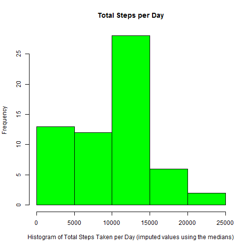

##Loading and preprocessing the data


```r
act <- read.csv("C:/Users/jdhuffaker/Documents/Coursera JHU Data Science Courses/05 Reproducible Research/Week 2/activity.csv",sep=",",header=TRUE)
```

##What is mean total number of steps taken per day?


```r
# Calculate the total steps (sum) taken per day using ddply.
library(plyr)
actSum <- ddply(act, .(date), summarize, Total_Steps=sum(steps))
```

####Histogram of the Total Steps Taken per Day

```r
# Generate a histogram.
hist(actSum$Total_Steps, xlab="Histogram of Total Steps Taken per Day", 
     main="Total Steps per Day",
     col="green")
```

 

```r
# Calculate the mean and median of the sum total steps per day,
mn1 <- round(mean(actSum$Total_Steps, na.rm=T),1)
md1 <- round(median(actSum$Total_Steps, na.rm=T),1)
```

The mean of the total number of steps taken per day is 1.07662 &times; 10<sup>4</sup>.

The median of the total number of steps taken per day is 1.0765 &times; 10<sup>4</sup>.


##What is the average daily activity pattern?

```r
# Make a subset of complete cases (where steps is not NA).
comp <- complete.cases(act)
actSub <- act[comp,][,1:3]

# Calculate the number of nonmissing cases where steps is not N/A.
nnonmiss <- nrow(actSub)

# Calculate the average steps for each 5-min interval across all days using ddply.
actMean <- ddply(actSub, .(interval), summarize, Average_Steps=mean(steps))

# Make a time series plot of the average stepsach 5-min interval across all days.
plot(actMean$interval,actMean$Average_Steps,type="l",lwd=2,col="blue",
     xlab="5 Minute Time Intervals",
     ylab="Average Steps", main="Average Steps by 5 Minute Time Intervals (across Days)")
```

 

```r
# Determine the interval that had the maximum average and also the value of the average.
maxavg <- max(actMean$Average_Steps)
actMax <- subset(actMean,Average_Steps==maxavg)
MaxInt <- actMax$interval
maxavg <- round(maxavg,1)
```

The 5-minute interval that contains the maximum number of steps on average across all the days is 835.

The maximum number of steps on average across all the days is 206.2.


###Imputing missing values

```r
# Generate a table of incomplete cases (where steps is NA)
comp <- !complete.cases(act)
actmiss <- act[comp,]

# ... or we can use the following 2 lines to subset incomplete cases
#act$Missing <- is.na(act$steps)
#actmiss <- subset(act, act$Missing=="TRUE",1:3)

# Calculate number of missing cases (rows where step is NA)
nmiss <- nrow(actmiss)


# Use averages as imputing missing values by time interval across days (using actSub from requirement 2).
actMean <- ddply(actSub, .(interval), summarize, Mean_Steps=mean(steps))

# Merge imputed values with missing subset.
actimpute <- merge(actmiss,actMean, by="interval")
actimpute$steps <- NULL
colnames(actimpute) <- c("interval","date","steps")

# Merge nonmissing data with imputed subset
act2 <- merge(actSub, actimpute, by=c("date", "interval","steps"), all=T)


# Use median as imputing missing values by time interval across days (using actSub from requirement 2).
actMedian <- ddply(actSub, .(interval), summarize, Median_Steps=median(steps))

# Merge imputed values with missing subset.
actimputemd <- merge(actmiss,actMedian, by="interval")
actimputemd$steps <- NULL
colnames(actimputemd) <- c("interval","date","steps")

# Merge nonmissing data with imputed subset
act2md <- merge(actSub, actimputemd, by=c("date", "interval","steps"), all=T)


# Using the average imputed values, calculate the totals steps per day, generate a histogram of the total steps per day, and calculate the mean and median of the total steps per day.
actSum2 <- ddply(act2, .(date), summarize, Total_Steps=sum(steps))

hist(actSum2$Total_Steps, xlab="Histogram of Total Steps Taken per Day (imputed values using the averges)", 
     main="Total Steps per Day",
     col="green")
```

 

```r
mn2 <- round(mean(actSum2$Total_Steps, na.rm=T),1)
md2 <- round(median(actSum2$Total_Steps, na.rm=T),1)

# Using the median imputed values, calculate the totals steps per day, generate a histogram of the total steps per day, and calculate the mean and median of the total steps per day.
actSum2md <- ddply(act2md, .(date), summarize, Total_Steps=sum(steps))

hist(actSum2md$Total_Steps, xlab="Histogram of Total Steps Taken per Day (imputed values using the medians)", 
     main="Total Steps per Day",
     col="green")
```

 

```r
mn3 <- round(mean(actSum2md$Total_Steps, na.rm=T),1)
md3 <- round(median(actSum2md$Total_Steps, na.rm=T),1)
```

The mean of the total number of steps taken per day (includes imputed missing data using the interval mean) is 1.07662 &times; 10<sup>4</sup>.

The median of the total number of steps taken per day (includes imputed missing data using the interval mean) is 1.07662 &times; 10<sup>4</sup>.

The mean of the total number of steps taken per day (includes imputed missing data using the interval median) is 9503.9.

The median of the total number of steps taken per day (includes imputed missing data using the interval median) is 1.0395 &times; 10<sup>4</sup>.


###Are there differences in activity patterns between weekdays and weekends?

```r
# Convert date column to a date class in another column and create a weekday column from the new data column.
act2$date2 <- as.Date(act2$date, "%m/%d/%Y")
act2$weekday <- weekdays(act2$date2)

# Change weekday to a factor variable.
act2$weekday <- as.factor(act2$weekday)

# Loop thru table and identify the weekday as a weekend or weekday.Call the new variable Day.
for(i in 1:nrow(act2)){
    if(act2$weekday[i]=="Saturday" | act2$weekday[i]=="Sunday"){
        act2$Day[i]="Weekend"
    } else{
        act2$Day[i]="Weekday"
    }
}

# Change the new variable to a factor variable.
act2$Day <- as.factor(act2$Day)

# Calculate the average steps across the weekend/weekday and interval variables.
actSum3 <- ddply(act2, .(Day, interval), summarize, Step_Mean=mean(steps))

# Generate a panel plot of the average steps across intervals for both weekend and weekday.
library(lattice)
xyplot(Step_Mean ~ interval|Day, 
       data = actSum3,
       type = "l",
       xlab = "Interval",
       ylab = "Average Number of Steps",
       layout=c(1,2))
```

 

###END OF REPORT
